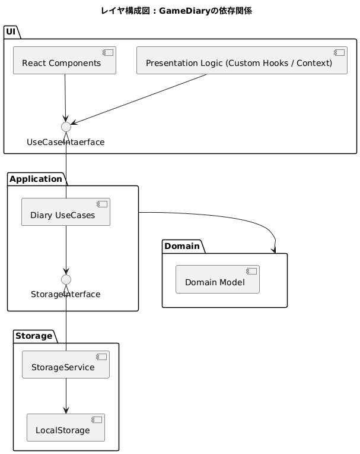
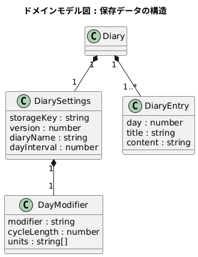
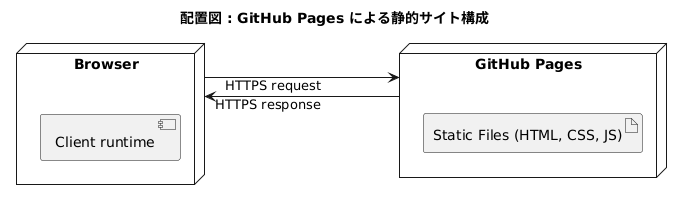

# GameDiary
URL: https://urusakuma.github.io/GameDiary/

## 概要

GameDiary は、シミュレーションゲーム向けの備忘録Webアプリケーションです。

シミュレーションゲームを長時間遊ぶユーザを想定し、ゲームの再開時に直前の状況や計画を振り返りやすいように開発しました。
また、ゲームプレイ時に使用しやすいようにSteamオーバーレイのブラウザで動作します。

本プロジェクトでは、UIから独立したドメイン駆動設計を意識し、高凝集度と依存方向の整理を試みました。

## 解決したかった課題

シミュレーションゲームというジャンルは一度のプレイが数十時間に及ぶことが度々あります。しかし、しばらく時間を空けてセーブデータを再開した際に「前回何をしようとしていたのか」を忘れてしまうことが何度もあります。

特に建築・素材集めなどの作業途中でプレイを中断した場合、直前の意図を把握していることが重要です。前回セーブ時と異なる意図でプレイしてしまうと大きな手間やゲームオーバーに至る可能性もあります。そのため、長期の計画を立てるには一連の流れを記録しておく必要があります。

既存のメモアプリや日記アプリを使うことも考えましたが、ゲーム内の日付などのテンプレートを毎回手動で記録する必要があることや、ページ管理の煩雑さが気になりました。現実のカレンダーではなく、ゲーム内時間を基準に自然に記録できる仕組みが欲しいと考えたのが、本アプリです。

GameDiary はもともと個人用のツールとして開発しました。その後、旧バージョン（jQuery）からReactへ移行し、UIの改善とともに設計の見直し、保存データの削減を行いました。

## レイヤー構成

### レイヤー構成

本アプリケーションは、責務ごとにレイヤーを分離した構成を採用しています。
依存関係は上位層から下位層への一方向のみとし、関心の分離を意識しています。

### レイヤード構成図

### ドメインモデル図

1. UI 層

   React Components
   Presentation Logic（Custom Hooks / Context）

   ユーザー入力を受け取り、Application 層の操作を呼び出します。
   ビジネスロジックは保持せず、状態の表示とイベント処理に専念します。

2. Application 層

   Diary UseCases

   アプリケーションの操作単位（例：日記の追加・削除・エクスポートなど）を実装します。
   Domain モデルを利用し、必要に応じて Repository を介してデータを取得・保存します。
   UI やストレージの詳細には依存しません。

3. Domain 層

   Domain Model

   日記という概念そのものを表現するモデルを定義します。
   ビジネスルールや振る舞いを保持し、他レイヤーには依存しません。
   本アプリケーションの中心となる層です。

4. Storage 層

   StorageService 実装

   データの永続化を担当します。
   Application 層からはインターフェース経由で利用され、
   具体的な保存手段（localStorage など）はこの層に閉じ込めています。

### 依存関係の方針

- UI → Application
- Application → Domain
- Application → Storage
- Domain は他層に依存しない

この構成により、

- UI 変更の影響をビジネスロジックへ波及させない
- 永続化手段を差し替え可能にする
- ドメインモデルを独立してテスト可能にする

ことを目的としています。

## 設計原則

本アプリケーションでは、SOLID原則などを意識し、以下の方向性で設計を行っています。

1. 依存関係の一方向性を保つ

   上位層は下位層に依存してよいが、下位層は上位層に依存しない。特に Domain 層は他層に依存しない。

2. 抽象に依存する

   具体実装ではなく、インターフェースに依存することで、アプリケーションロジックや永続化手段を差し替え可能にする。

3. 単一責務を意識する

   クラスやモジュールは変更理由が一つになるように分割する。

4. 副作用を境界に閉じ込める

   ストレージ操作や外部I/Oは Application 層または Storage 層に限定し、Domain モデルは純粋な振る舞いを保つ。

5. 拡張は追加で行う

   既存コードの修正よりも、新しい実装や新しいクラスの追加で拡張できる構造を目指す。

## 技術スタック

- フロントエンド

  - プレゼンテーションロジック: React + TypeScript
    UI コンポーネントと状態管理、Custom Hooks / Context を用いたプレゼンテーションロジックに利用。
  - ビジネスロジック: TypeScript
    Domain モデルやアプリケーションユースケースを実装し、日記データの操作やルールを管理。

- フレームワーク: Next.js

  静的サイト生成に利用。GitHub Pages で公開中。

- その他ユーティリティ:

  - lz-string: 圧縮に利用

- 開発環境
  - VSCode
  - Git/GitHub
  - Docker: 開発環境の固定と PlantUML サーバに利用

## テスト戦略

- 対象層

  - Domain 層: 日記データやルールの操作に関する単体テストを全ファイルにて実施
  - Application 層: フロントエンド上のビジネスロジック（Domain モデルの操作や永続化処理）の単体テストを全ファイルにて実施
  - コントローラー層: UI層実装に伴い実装変更により現状テスト未実施
  - UI 層: E2Eにより Custom Hooks / Context などの結合動作を確認

- テスト手法

  - 単体テストが中心
  - E2Eでの動作確認も実施

- 使用フレームワーク

  - Jest

- 実行環境
  - ローカルのみでテストを実行

## CI/CD

### デプロイメント図

- GitHub Actions による自動化
  - main ブランチへの push に応じて静的サイトのビルドと GitHub Pages へのデプロイを実行
  - ビルド環境は Node.js 20、Next.js を使用
  - 現状、テストやコード解析は自動化していない

## スクリーンショット

- Steam オーバーレイ上で動作している状態
- 新しいエントリの作成と未入力のエントリ削除
